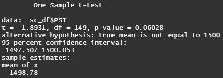
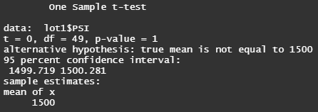
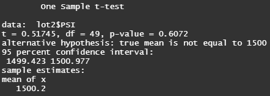
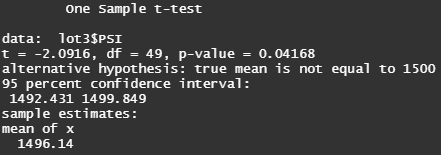

## Overview
A statistical analysis of production data for a car manufacturer.  

## Results

### Linear Regression to Predict MPG
Various design specifications were used to manufacture 50 prototype cars in an effort to identify ideal vehicle performance. Each vehicle was subjected to fuel efficiency testing (miles per gallon, or MPG) and the following metrics were measured for each vehicle for comparison: vehicle length, weight, spoiler angle, ground clearance and drivetrain type. 

> * H0: there is no correlation between the measured vehicle metrics and MPG results in the prototypes.
> * Ha: at least one of these vehicle metrics accounts for non-random variance observed in the MPG results. 
> * Significance level (alpha = 0.05) was established before multiple regression was performed on the dataset.

The regression model slope is considered to be non-zero (F-statistic p<0.05, therefore the H0 that the overall model slope is 0 can be rejected). The model fits the data fairly well, accounting for 71% of the variability in the observed data (multiple R-squared = 0.71). Both vehicle length and ground clearance metrics (p<0.001, therefore reject the H0) are statistically significant predictors of fuel efficiency compared to other metrics.

### Summary Statistics on Suspension Coils
Design specifications for suspension coils dictate variance must not exceed 100 psi to pass lot testing. 

The mean (1498.78 psi) and median (1500 psi) PSI for total manufactured suspension coils is very similar, indicating a symmetric distribution where the standard deviation is 7.89 psi and variance is 62.3 psi. 

While the variance constraint may be met for the total manufactured coils, the summary statistics for each lot indicates that the variance for lot 3 has exceeded the 100 psi maximum. Lots 1 and 2 remain within the tolerated psi max. 

    <table>
        <tr>
            <td>Summary Statistics (Total)</td>
            <td>Summary Statistics (per lot)</td>
        </tr>
	    <tr>
    	    <td style="padding:10px">
        	    
      	    </td>
            <td style="padding:10px">
            	
            </td>
        </tr>
    </table>

These summaries are also visualized by boxplots where the outliers are easily identified.

 

### T-Tests on Suspension Coils
T-tests were performed to determine if all manufacturing lots and each individual lot are statistically different from the population mean of 1,500 psi. The null hypothesis for each of the tests are similar, H0: There is no difference between the total mean/lot means and the population mean of 1500 psi. Similarly, the Ha states that there is a statistical difference between the total mean/lot means. The significance level (alpha = 0.05) was established prior to testing.

    <table>
        <tr>
	    <td>T Test Results for All Lots</td>
	</tr>
	<tr>
	    <td style="padding:10px">
		    
	    </td>
	</tr>
    	<tr>
            <td>T Test Results for Lot 1</td>
            <td>T Test Results for Lot 2</td>
            <td>T Test Results for Lot 3</td>
        </tr>
	    <tr>
    	    <td style="padding:10px">
        	    
      	    </td>
            <td style="padding:10px">
        	    
      	    </td>
            <td style="padding:10px">
        	    
      	    </td>
        </tr>
    </table>

With the results of the T test, the following decisions can be made:
* Total Manufactured Suspension Coils failed to reject the null hypothesis (p-value = 0.06), there is no difference between the sample mean and the population mean of 1500 psi.
* Suspension coils from Lot 1 failed to reject the null hypothesis (p-value = 1), there is no difference between the sample mean and the population mean of 1500 psi.
* Suspension coils from Lot 2 failed to reject the null hypothesis (p-value = 0.61), there is no difference between the sample mean and the population mean of 1500 psi.
* Suspension coils from Lot 3 rejected the null hypothesis (p-value = 0.04), there is a statistical difference between the sample mean and the population mean of 1500 psi.

## Study Design: MechaCar prototypes vs the Competition
In a future study, the performance of the MechaCar will be compared against vehicles from other manufacturers (at least n=3) to determine if there is a difference in their fuel efficiencies (mpg). As there is one categorical independent variable and one quantitative dependent variable (measured by mpg) with multiple groups to be compared, a one-way ANOVA should be performed in R using aov() and summary() functions. A significance level of 0.05 is sufficient to test the hypotheses using the resulting p-values:
> * H0: The MechaCar performs as well as competitor vehicles in fuel efficiency
> * Ha: At least one manufacturer's vehicle differs significantly from the overall mean
If the ANOVA results indicate that there is significant differences among the considered vehicles, performing a TukeyHSD (in R, TukeyHSD() function) post-hoc test can reveal which groups are statiscally different from one another.
